# MPI Image Filter

A program that uses MPI to speed up the application of certain filter to a PGM or PNM image.

Check README (without .md) for detailed explanation of the implementation

## MPI Install

```
sudo apt-get update
sudo apt-get install lam4-dev mpich openmpi-bin
```

## Build

```
make
```

## Usage

Command

```
mpirun -np N ./tema3 image_in.pnm image_out.pnm filter1 filter2 ... filterX
```

- N - number of computing units
- filterX - filter to be applied to the input image
  - smooth
  - blur
  - sharpen
  - mean
  - emboss

Example

```
mpirun -np 4 ./tema3 baby-yoda.pnm baby-yoda-emboss.pnm emboss
```

---

## Filters

The program represents the filters as a 3x3 Matrix. Below you can find a detailed view of the filters available in the program:

### Smoothing filter

Improves the differences in images.

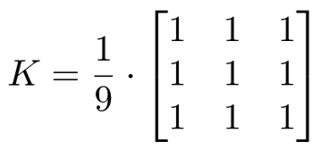

### Approximative Gaussian Blur filter

Reduces the background noise in the image.

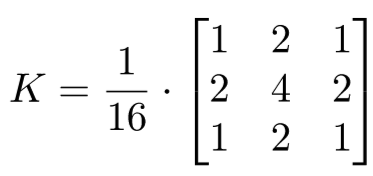

### Sharpen

Accentuates the details in the image.

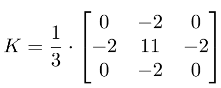

### Mean removal

Similar to "Sharpen" it improves the details in the image but Mean removal uses the values of the diagonal adjacent pixels

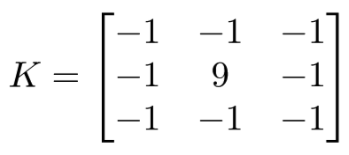

### Emboss

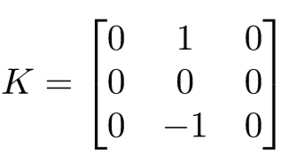

---

## Usage examples

### Original image:


---

### Sharpen

```
mpirun -np 4 ./tema3 darth-vader.pgm dv-shapren.pgm sharpen

```

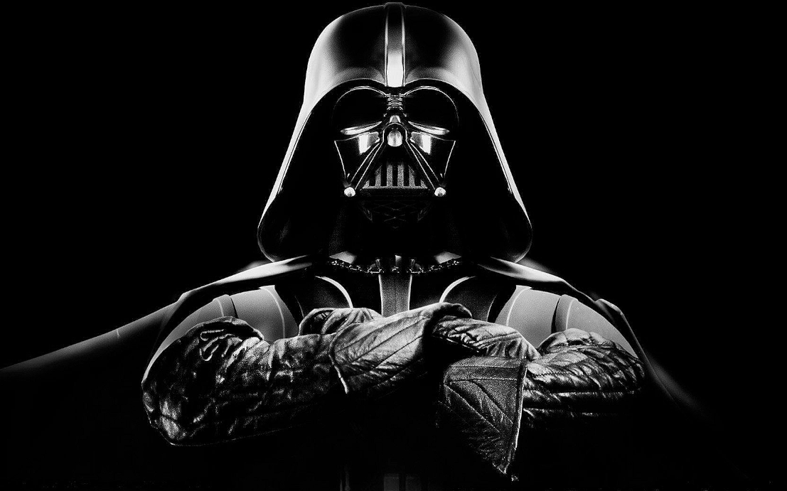

---

### Blur

```
mpirun -np 4 ./tema3 darth-vader.pgm dv-blur.pgm blur

```


---

### Mean

```
mpirun -np 4 ./tema3 darth-vader.pgm dv-mean.pgm mean

```

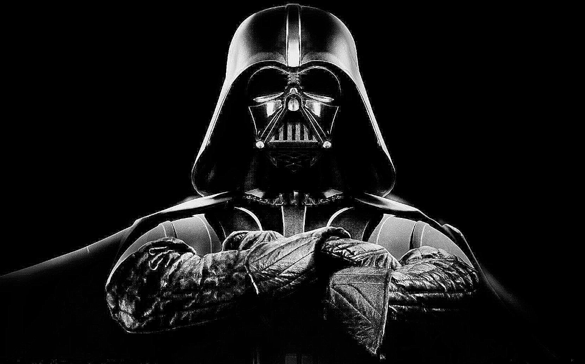

---

### Smooth

```
mpirun -np 4 ./tema3 darth-vader.pgm dv-smooth.pgm smooth

```

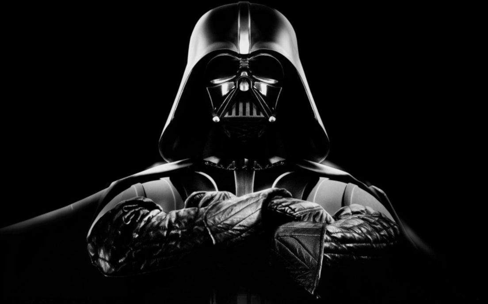

---

### Extra smooth

```
mpirun -np 4 ./tema3 darth-vader.pgm dv-extra-smooth.pgm smooth smooth smooth

```

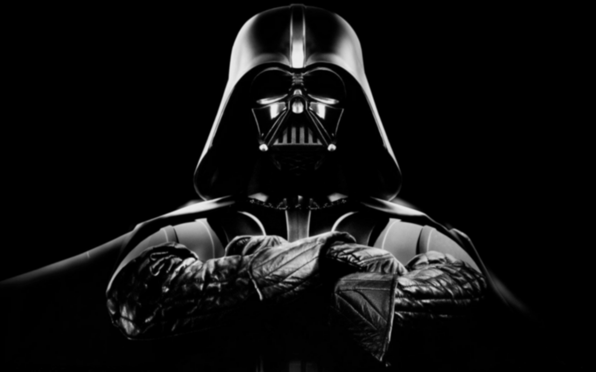

---

### Emboss

```
mpirun -np 4 ./tema3 darth-vader.pgm dv-emboss.pgm emboss

```

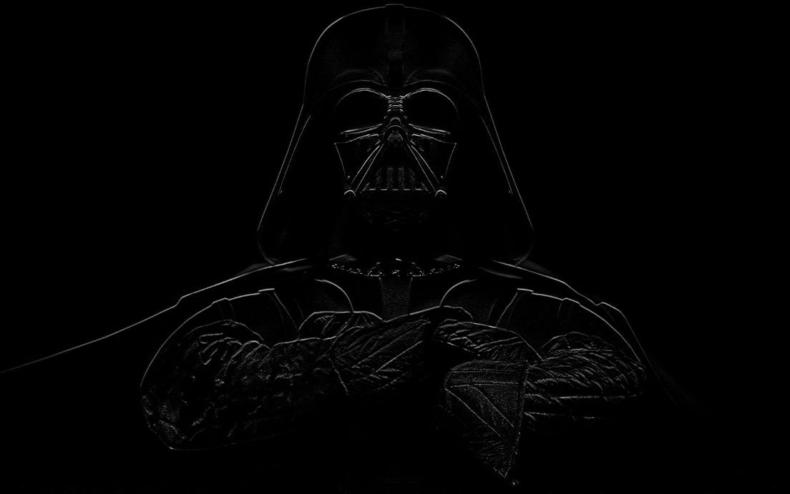

---

### All

```
mpirun -np 4 ./tema3 darth-vader.pgm dv-all.pgm smooth blur sharpen mean emboss

```

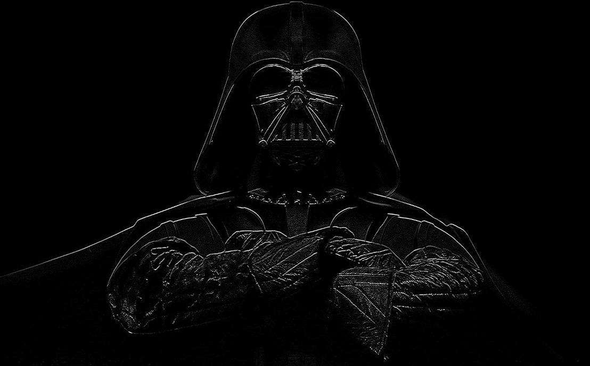
